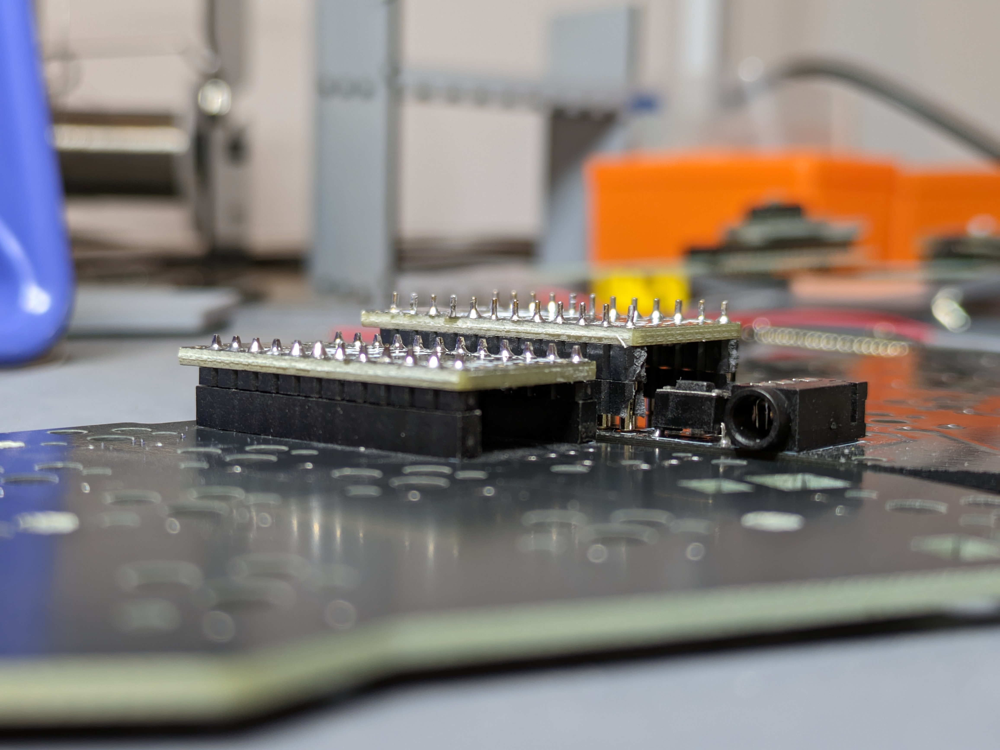

# Buyer's Guide

At holykeebs, we specialize in low profile ergonomic keyboards with pointing devices.

A mechanical keyboard is comprised of various parts, allowing a relatively high degree of customization compared to a regular keyboard.

This guide will help you choose through the various options when buying a keyboard.

::: info
We cover all options here. If a product you're looking at is missing something then it's either incompatible, or a mistake. Reach out if in doubt.
:::

## Build Service

This option gives you a choice of:

1. Getting all parts required to build a keyboard, you have to solder and assemble it.
2. Getting a soldered keyboard and additional hardware, you have to assemble it (e.g. push the switches into hotswap sockets, keycaps into switches, screw bottom plate etc.).
3. Getting a fully assembled and tested keyboard, just plug it in.

## Controllers

All of the keyboards we offer use a top mounted USB-C microcontroller, with split keyboards using one on each keyboard half.

1. [Sea Picro](https://joshajohnson.com/sea-picro/): this open source microcontroller uses an RP2040 chip with lots of storage. We recommend choosing this as RP2040 based controllers are becoming the standard for DIY keyboards.
1. Pro Micro: the Arduino Pro Micro has been around for a long time and is well supported in QMK. It is relatively low on storage, making it a less favorable option if you plan on customizing your firmware (e.g. many keymap layers, custom OLED graphics, etc.).

## Headers

All of our keyboards come with machine sockets for controllers. This option determines what headers go into those sockets.

We currently have two options, the main difference is how much height each one adds to the "controller stack".

1. Machine headers: a strip of pins + 3mm plastic that match the machine sockets.
1. Mill Max pins: these come as a individual gold plated pins that can be inserted into the sockets. These have no plastic and so provide a lower height than machine headers. The downside is dealing with individual pins which can be a bit of a pain, and the high cost of this item.

## Pointing Device

1. [Pimoroni Trackball](https://shop.pimoroni.com/products/trackball-breakout?variant=27672765038675): a small, RGBW-illuminated, clickable trackball.
1. Trackpoint: these are commonly found in Lenovo laptops. If you've used one in the past, you can expect similar movement and sensitivity.

While the trackball is a very usable pointing device, given its size it is less accurate than the trackpoint. The movement style is different though: the trackball doesn't require constant engagement to move in a certain direction, simply scrolling the ball moves it. On the other hand, the trackpoint needs to be held to keep moving.

Additionally, the trackball is clickable and has a built in RGBW LED. Even though the trackpoint has no buttons, this is easily solved by assigning mouse keys to the split side without the pointing device. For example, if the right side of the keyboard has the trackpoint, on the left side a few keys are assigned to do left, right clicks, etc. This is a common setup for both devices.

Generally speaking, both pointing devices are great for navigation, browsing, code editing and doing other activities that complement otherwise "standard" computer usage. They are not suitable for gaming.

## Switches

There are 3 switch categories: linear, tactile and clicky. A lot has been said on this topic, please search around to understand the differences and watch some videos to decide which one might work for you.

If you can't decide, make sure you get hotswap sockets and consider the Red Pro linear switches, which are a common choice.

### Hotswap Sockets

Hotswap sockets allow socketing the switches (rather than soldering them directly to the PCB).

They are easy to solder and are generally a good idea if you're not set on a switch or want the freedom to change them in the future.

### Stabilizers

The purpose of a stabilizer is to provide an even pressing surface across a wide keycap. The [Span](https://holykeebs.com/products/span) keyboard uses 2u keys, which have an option to use stabilizers.

Stabilizers are generally recommended, although do add a bit of work in the build process. 2u keys are very usable even without stabilizers.

## Keycaps

MBK keycaps are the most popular low profile keycaps, which come either blank or with legends.

::: tip
Adding a few [colored keycaps](https://holykeebs.com/products/mbk-dyed-low-profile-keycaps) is a great way to make your keyboard unique!
:::

## OLED

A small 128x32 OLED display that sits on top of the controller. These displays can be programmed to display a static image, or other dynamic information such as WPM, current layer, etc.

## Top Plates

On keyboards with hotswap sockets, a top plate is used to better secure the switches to the keyboard. Even though the keys will not fall off without one, it is recommended to have.

They can also be added to non-hotswap builds for the aesthetics, even though we keep the top side of our PCBs super clean!

::: info
A top plate is **required** if you'd like stabilizers for 2u keys, like the [Span](https://holykeebs.com/products/span) keyboard supports.
:::

## Bottom Plates / Cases

A bottom plate / case sits under the keyboard PCB and is a low cost option compared to a fully enclosed machined metal / plastic molded case.

We carry a variety of colors for laser cut acrylic plates or 3d printed cases.

<Images :paths="[cases1, cases2, cases3, cases4]" />

## Covers

Covers can be mounted on trackpoints and OLEDs for a better look / protection. All of our covers are laser cut acrylic in glossy, matte or translucent colors.

## More

Still have questions? Visit our [discord](https://discord.com/invite/Hd6X7yd5xF) or [contact us](https://holykeebs.com/pages/contact).
