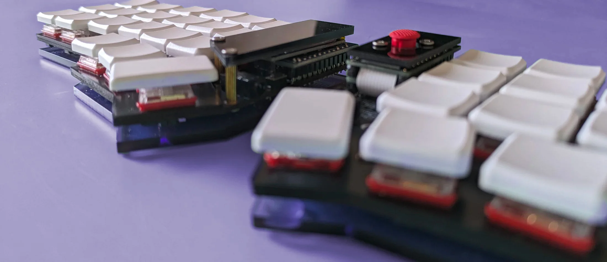
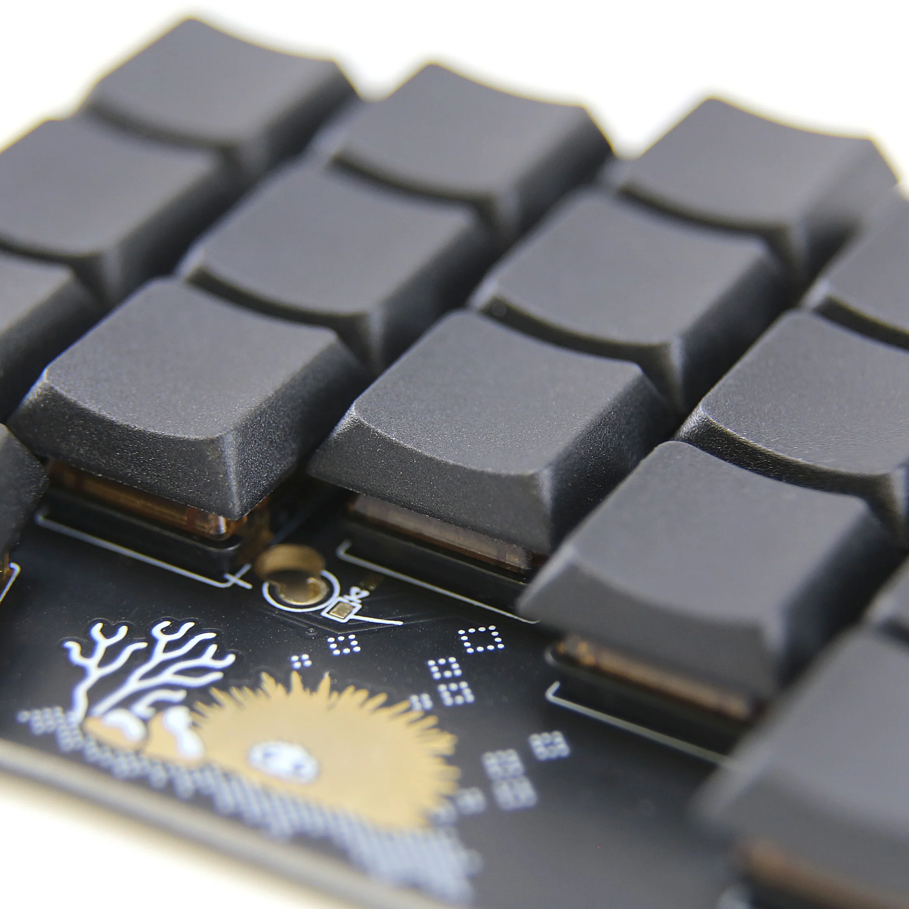
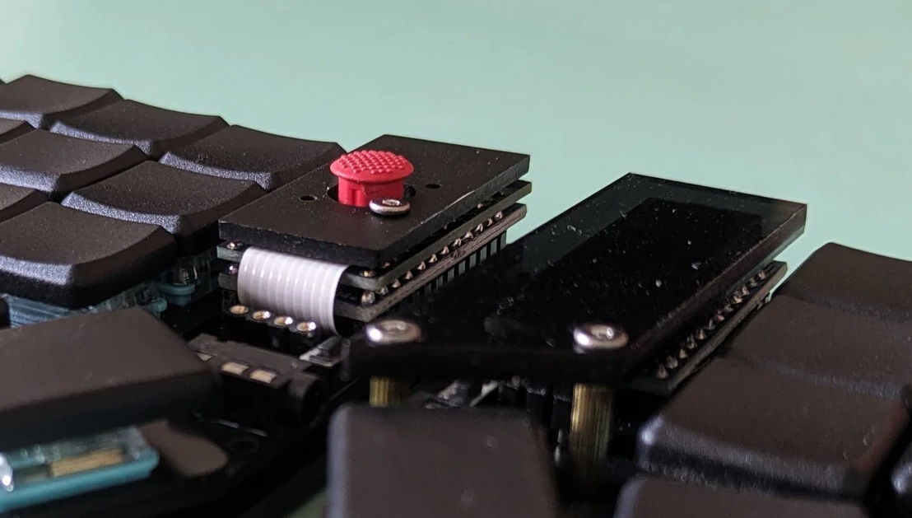

# Buyer's Guide

At holykeebs, we specialize in low profile ergonomic keyboards with pointing devices.

A mechanical keyboard is comprised of various parts, allowing a relatively high degree of customization compared to a regular keyboard.

This guide will help you choose through the various options when buying a keyboard.

::: info
We cover all options here. If a product you're looking at is missing something then it's either incompatible, or a mistake. Reach out if in doubt.
:::

## Build Service

This option gives you a choice of:

1. Getting all parts required to build a keyboard, you have to solder and assemble it.
2. Getting a soldered keyboard and additional hardware, you have to assemble it (e.g. push the switches into hotswap sockets, keycaps into switches, screw bottom plate etc.).
3. Getting a fully assembled and tested keyboard, just plug it in.

::: info
Soldered but unassembled keyboards are electrically tested to the extent possible. In the event that something got missed or doesn't work on arrival, please reach out and when possible we'll try to fix things remotely depending on your skillset and severity of the problem.
:::

## Controllers

All of the keyboards we sell use a top mounted USB-C microcontroller, with split keyboards using one on each keyboard half.

[Sea Picro](https://joshajohnson.com/sea-picro/) is an open source microcontroller which uses an RP2040 chip with lots of storage. RP2040 based controllers are becoming the standard for DIY keyboards and are thus favored over Pro Micro clones (which we no longer offer), that are comparatively low on storage.

## Sockets, Headers

Socketing the controllers is always a good idea because removing a faulty controller that was soldered to a PCB can be a very frustrating experience.

All of the keyboards we build come with socketed controllers. We currently have two options, the main difference is how much height each one adds to the "controller stack" (these two options aren't compatible with one another).

1. Machine headers (PCB to controller height: 7.5mm): a strip of pins + 3mm plastic that match the machine sockets. These are cut from 40 pin strips.
1. Custom low profile headers (PCB to controller height: 5mm): these are custom made sockets and headers, that are ideal for low profile keyboards with a pointing device, as the reduced height can be an improvement for finger movement.

::: warning
When choosing the headers for a pointing device module for an existing keyboard you own, make sure your sockets are compatible with the ones you pick (or use your own headers).
:::

## Pointing Device

<Images :paths="[pointingdevice1, pointingdevice2]" />

1. [Cirque 35mm Touchpad](https://www.cirque.com/glidepoint-circle-trackpads): a compact, high resolution, gesture enabled touchpad.
1. [Pimoroni Trackball](https://shop.pimoroni.com/products/trackball-breakout?variant=27672765038675): a small, RGBW-illuminated, clickable trackball.
1. [Trackpoint](https://www.sprintek.com/en/products/PointingStick.aspx): these are commonly found in Lenovo laptops. If you've used one in the past, you can expect similar movement and sensitivity.

While the trackball is a very usable pointing device, given its size it is the least accurate of the 3 and is mostly recommended as an off-hand device, rather than a mouse replacement. Some do find it adequete as a main pointing device (author included).

Both trackball and touchpad support clicking, and it is common to use [mouse keys](https://docs.qmk.fm/#/feature_mouse_keys) on the split side without the pointing device. For example, if the right side of the keyboard has a trackpoint, on the left side a few keys are assigned to do left click, right click, scroll mode, etc.

Generally speaking, all pointing devices are great for navigation, browsing, code editing and doing other activities that complement otherwise "standard" computer usage. They are not suitable for gaming.

::: info
A pointing device and OLED display share the same location on the keyboard, it is possible to only have one or the other on a given side.
:::

## Switches

There are 3 switch categories: linear, tactile and clicky. A lot has been said on this topic, please search around to understand the differences and watch some videos to decide which one might work for you.

If you can't decide, make sure you get hotswap sockets and consider the Red Pro linear switches, which are a common choice.

### Hotswap Sockets

Hotswap sockets allow socketing the switches (rather than soldering them directly to the PCB).

They are easy to solder and are generally a good idea if you're not set on a switch or want the freedom to change them in the future.

### Stabilizers

The purpose of a stabilizer is to provide an even pressing surface across a wide keycap. The [Span](https://holykeebs.com/products/span) keyboard uses 2u keys, which have an option to use stabilizers.

Stabilizers are generally recommended, although do add a bit of work in the build process. 2u keys are very usable even without stabilizers.

## Key Spacing

There are two standard "key spacing", i.e. how close the keys are to each other:

1. MX keyboards use a grid of 19x19mm squares. Some keyboards with choc switches also use this, which results in small gaps between keys.
1. Choc spacing uses 18x17mm squares, and produces a more tight arrangement with minimal key spacing. It is specifically designed for Kailh's choc switches (hence the name).

For choc keyboards, we differentiate these two styles of spacing by calling the former Low Profile and the latter Choc.

## Keycaps

The keyboards we sell are exclusively using 1U, 1.5U and 2U key sizes. Unlike MX switches, there aren't many keycap options for choc switches.

[MBK keycaps](https://holykeebs.com/products/mbk-low-profile-keycaps) are the most popular low profile keycaps, which come either blank, colored or with legends.

Another option that recently came about are [DDC](https://holykeebs.com/products/ddc-choc-pbt-blank-keycaps), which try to emulate the traditional cylindrical profiles. DDC are currently only available in 1U / homing, so for keyboards with 1.5U / 2U keys we will use the MBK variant for those key sizes.

Both of these keycaps are PBT and are slightly textured.

::: tip
Adding a few [colored keycaps](https://holykeebs.com/products/mbk-dyed-low-profile-keycaps) is a great way to make your keyboard unique!
:::

## OLED

::: info
A pointing device and OLED display share the same location on the keyboard, it is possible to only have one or the other on a given side.
:::

A small 128x32 OLED display that sits on top of the controller. These displays can be programmed to display a static image, or other dynamic information such as WPM, current layer, etc.

## Top Plates

On keyboards with hotswap sockets, an FR4 top plate is used to better secure the switches to the keyboard (they are therefore sometimes called switch plates). Even though the keys will not fall off without one, it is recommended to have.

They can also be added to non-hotswap builds for the aesthetics, even though we keep the top side of our PCBs super clean!

::: info
A top plate is **required** if you'd like stabilizers for 2u keys, like the [Span](https://holykeebs.com/products/span) keyboard supports.
:::

MX keyboards also have the option of having an additional acrylic piece at the top, which is a nice addition if LEDs are used and helps fill the gap between the PCB and top plate:

## Bottom Plates / Cases

A bottom plate / case sits under the keyboard PCB and is a low cost option compared to a fully enclosed machined metal / plastic molded case.

We carry a variety of colors for laser cut acrylic plates or 3d printed cases. Our 3d printed cases feature a thin bezel that is the same height as the top plate of the keyboard.

<Images :paths="[cases1, cases2, cases3, cases4]" />

## Covers

Covers can be mounted on trackpoints and OLEDs for a better look / protection. All of our covers are laser cut acrylic in glossy, matte or translucent colors.

## Keyball

Most of the guide above applies to Keyball lineup of keyboards as well, it stands out in a few ways described below.

First, it's worth noting that our Keyball differ from the one sold by Yushakobo / Shirogane Lab. In terms of cosmetics, we use black PCBs, different thickness acrylic plates and different M2 screws. Additionally, we use Sea-Picro. The rest is identical.

### 34mm Trackball

Keyball uses a 34mm trackball that's not included in your purchase. There are many color options to choose from, and the ones made by [Perixx are a popular choice](https://www.amazon.com/Perixx-PERIPRO-303-GLG-Trackball-Compatible/dp/B07BDHK2MR).

### Thumb Cluster

Keyball has a unique thumb cluster that allows either Kailh's choc low profile or MX switches. If you're building the keyboard yourself and you're not sure which one, add a pack of low profile hotswap sockets to your order to have both options.

### LEDs

We are doing a trial run of offering LEDs as part of our kits / build service. You can either get the LEDs unsoldered or soldered. There's an additional build charge on top of the build service cost for soldering LEDs due to the amount of extra work required.

## More

Still have questions? Visit our [discord](https://discord.com/invite/Hd6X7yd5xF) or [contact us](https://holykeebs.com/pages/contact).
