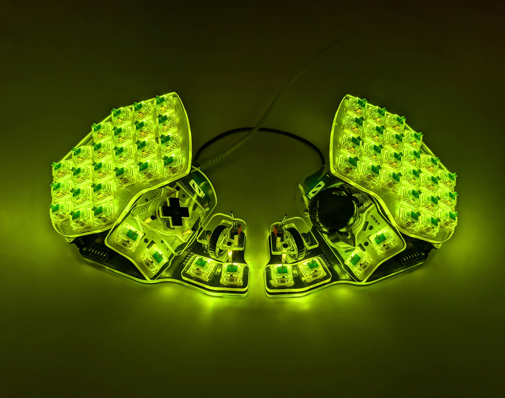
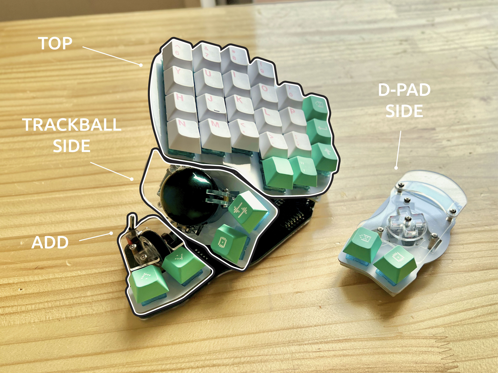
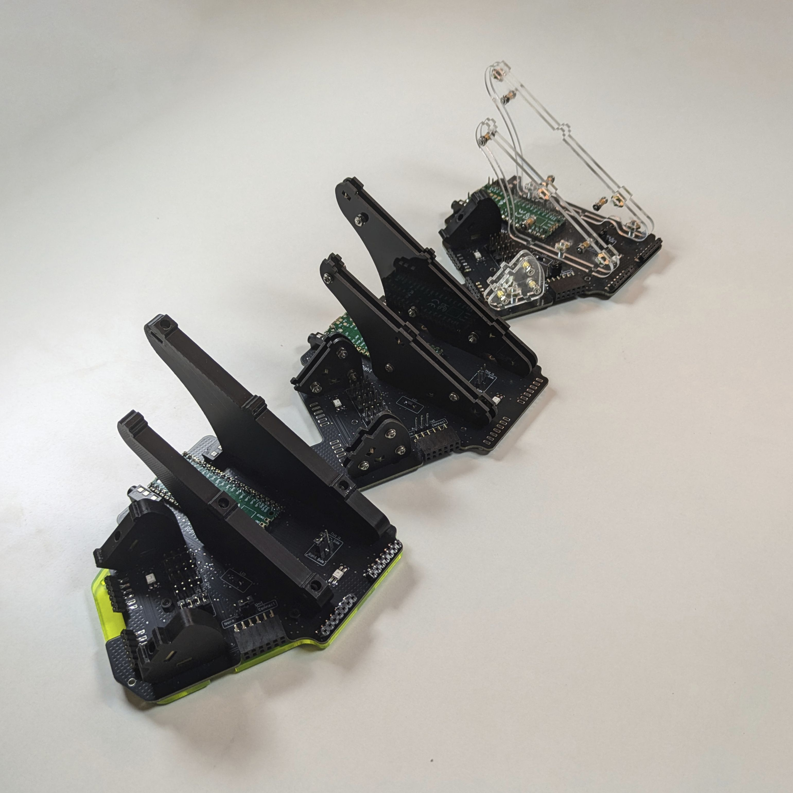
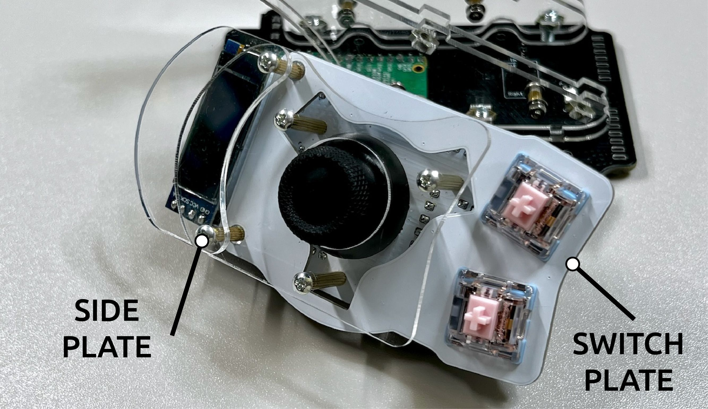

# Killer Whale

Killer Whale keyboard is a split keyboard with a unique and versatile thumb cluster, created by Taro Hayashi.

Main features:

- 48-56 keys (4 key thumb cluster on each side)
- 30 degree tilt
- trackball, d-pad or joystick thumb cluster on each side
- built in scroll wheel and toggle switch on each side
- modular build - thumb clusters can be swapped for others (or removed altogether)

In addition to these functional features, Killer Whale offers a unique look with acrylic (or printed) pillars that structurally support the different parts of the keyboard.

<Images :paths="[frontview, sideview]" />

Killer Whale is also sold on Yushakobo, a popular Japanese marketplace. The version brought by holykeebs brings a few "quality of life" improvements that make the build easier, without sacrificing the tenets that make this keyboard awesome.

## Buyer's Guide

Killer Whale is comprised of 3 distinct sections (per half):

- **TOP**: main typing area, tilted 30 degrees, 26 keys with per key LEDs
- **SIDE**: thumb cluster with 2 keys that can be either a trackball, a joystick, or a 4 key gamepad style D-pad
- **ADD**: an additional thumb cluster with 2 keys, a scroll wheel, and a toggle switch

With these extra parts, the keyboard uses more components and fasteners compared to a "regular" DIY split keyboard like a Corne or a Lily58.

If this is your first keyboard, the general purpose Build Guide is a recommended read, even though some of the options are not relevant to Killer Whale.

### Build Service

Similar to our other keyboards, we offer keyboards in kit form (no build service) or fully soldered. A fully soldered keyboard **is not plug and play**, and requires assembly of some mechanical parts (namely connecting the top, side and add units to the keyboard, and screwing the pillars into place). See the build guide for more information.

::: info
Currenly we cannot offer a fully assembled Killer Whale due to its size and risk of damage during shipping.
:::

### Colorway

The colorway lets you choose the colors of the various plates and mechanical parts in the keyboard:

- **Support Pillars / Posts**: these are one of Killer Whale's most recognizable features. They support the top and side units at a 30 degree angle, and come with two variants: acrylic (in clear or one side matte/one side glossy black), or 3d printed. Other than giving the keyboard a different look, these options differ in the amount of time it takes to build them. The acrylic variants make use of spacers, washers, nuts and screws to achieve the desired sturdiness and thickness. If you enjoy Lego or puzzles or working with small parts, this could be a fun build for you (check the [build guide](https://github.com/Taro-Hayashi/KillerWhale/blob/main/rightside/2_BASE.md#supports) to get a taste). Otherwise, consider going for the printed variant, which use far less hardware to assemble, and are available in a lot of colors.

- **Switch Plates**: plates that switches hook into. Each section in the keyboard has one (top, side, additional). You may choose either white PCB (FR4) or 3mm acrylic in one of several colors.

<Images :paths="[switchplatepcb, switchplateacrylic]" />

- **Side Plates**: plates that cover the hardware and OLEDs in the side units. Comes in various acrylic colors.

- **Bottom Plates**: plates that cover the under side of the keyboard. Comes in various acrylic colors.

::: info
To fully customize the colors of this option, choose the Custom colorway and add [this item](https://holykeebs.com/products/killer-whale-custom-color) to your cart.
:::

### Side Units

Each half of the keyboard supports one of 3 side units:

<Images :paths="[sidetrackball, sidejoystick, sidedpad]" />

- A 34mm trackball using the high resolution PMW3360 sensor.
- An analog joystick that can function as a mouse or for gaming.
- A game pad style d-pad with 4 up/down/left/right micro buttons.

All side units have 2 thumb keys and are not specific to the left or right side of the keyboard. They can be moved around based on what feels comfortable to you.

::: info
To fully customize the colors of this option, choose the Custom colorway and add [this item](https://holykeebs.com/products/killer-whale-custom-color) to your cart.
:::

### OLED

A small 128x32 OLED display that sits on the side units. These displays come preprogrammed to display keyboard information such as current layer, mouse mode, etc.

## Build Guide

The build is covered in the official Killer Whale github repository: https://github.com/Taro-Hayashi/KillerWhale/blob/main/README_EN.md.

Covered here are some general tips and commentary on the build, with specific instructions on parts we've changed to improve the build process.

### Introduction

The keyboard can be thought of as having 4 sections (per half), illustrated below:

As these sections are all positioned at an angle relative to BASE, there are connection points between them. An added benefit is that the SIDE units can moved around to your liking, or removed altogether for a bare bones, switches only keyboard.

One thing you'll notice when going over the Killer Whale guide is that we've provided a PCB where components are all SMD mounted (diodes, resistors, capacitors, etc.) instead of being through-hole. We believe this makes the build easier, while also making it hot plate/reflow oven friendly, aligning it with the rest of our keyboards.

Additionally, we have moved all components to be soldered on one side of the PCBs.

### Support Pillars

In order to position the TOP and SIDE units (and trackball), the keyboard uses a clever support structure design (also called posts or pillars). There are two variants:

- acrylic: these are built using 2mm plates that are spaced out using 3mm standoffs, combined to a thickness of 7mm. Assembling the acrylic posts is rather time consuming and repetitve as it involves many screws, nuts, washers and spacers.
- printed: these side step the lengthy build time of the acrylic posts by using far less hardware, only requiring the square nuts.

### BASE

The base unit is brains of the keyboard with Pi Pico controller and where all the sections connect to. The picos arrive with precut 20P headers.

If soldering LEDs, only a diode is required in the area labeled LED on the PCB.

Continue by following the official guide ([left](https://github.com/Taro-Hayashi/KillerWhale/blob/main/leftside/2_BASE.md), [right](https://github.com/Taro-Hayashi/KillerWhale/blob/main/rightside/2_BASE.md)).

### SIDE: Trackball

Follow the official guide ([left](https://github.com/Taro-Hayashi/KillerWhale/blob/main/leftside/3_SIDE_TRACKBALL.md), [right](https://github.com/Taro-Hayashi/KillerWhale/blob/main/rightside/3_SIDE_TRACKBALL.md)), and take note of these things:

The pin headers are inserted on the bottom side of the PCB (where everything was soldered), with the long side going through the PCB. It's best to cut the pins on that side to be flush with the PCB before soldering.

When assembling the trackball posts, if your kit came with printed ones, the build is a bit simpler and only requires threading a washer and a bearing into a 10mm M2 screw, secure the other side with a washer, spring washer and a nut. Repeat 2 more times.

Place a square nut in each post, centering its hole with the screw hole, and position them on the PCB with an M3 screw.

### SIDE: D-Pad

Follow the official guide ([left](https://github.com/Taro-Hayashi/KillerWhale/blob/main/leftside/3_SIDE_DPAD.md), [right](https://github.com/Taro-Hayashi/KillerWhale/blob/main/rightside/3_SIDE_DPAD.md)), and take note of these things:

The pin headers are inserted on the bottom side of the PCB (where everything was soldered), with the long side going through the PCB. It's best to cut the pins on that side to be flush with the PCB before soldering.

### SIDE: Joystick

Follow the official guide ([left](https://github.com/Taro-Hayashi/KillerWhale/blob/main/leftside/3_SIDE_JOYSTICK.md), [right](https://github.com/Taro-Hayashi/KillerWhale/blob/main/rightside/3_SIDE_JOYSTICK.md)), and take note of these things:

The pin headers are inserted on the bottom side of the PCB (where everything was soldered), with the long side going through the PCB. It's best to cut the pins on that side to be flush with the PCB before soldering.

### TOP Unit

Follow the official guide ([left](https://github.com/Taro-Hayashi/KillerWhale/blob/main/leftside/4_TOP.md), [right](https://github.com/Taro-Hayashi/KillerWhale/blob/main/rightside/4_TOP.md)), and take note of these things:

The pin headers are inserted on the bottom side of the PCB (where everything was soldered), with the long side going through the PCB. It's best to cut the pins on that side to be flush with the PCB before soldering.

If you chose acrylic switch plates, you'll find M3 screws with a flatter head than the rest of the M3 screws in the kit. Use these for fixturing the PCB to the pillars.

### ADD Unit

Follow the official guide ([left](https://github.com/Taro-Hayashi/KillerWhale/blob/main/leftside/5_ADD.md), [right](https://github.com/Taro-Hayashi/KillerWhale/blob/main/rightside/5_ADD.md)).

### Assembly

Follow the official guide ([left](https://github.com/Taro-Hayashi/KillerWhale/blob/main/leftside/6_ASSEMBLE.md), [right](https://github.com/Taro-Hayashi/KillerWhale/blob/main/rightside/6_ASSEMBLE.md)).
